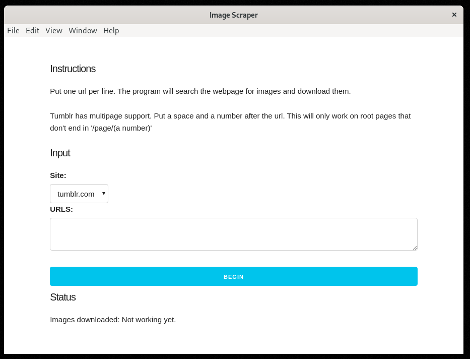

# Image Scraper

Simple image scraper for the web. Built in support for tumblr.



## Usage

```bash
git clone https://github.com/violetcraze/image-scraper.git
cd image-scraper
npm i
npm start
```

Then follow instructions in electron app.

## Contributing

Mostly designed as a personal tool. And I haven't fixed most of the bugs. If you'd like to contribute by fixing bugs or expanding functionality that would be great.